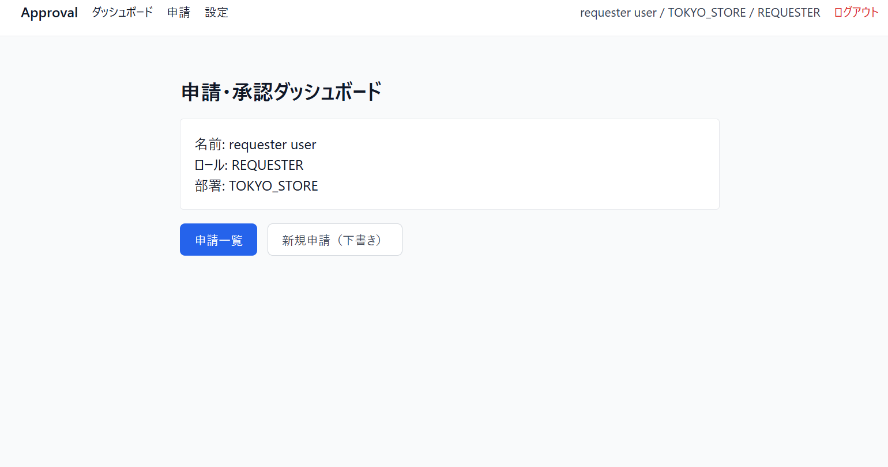
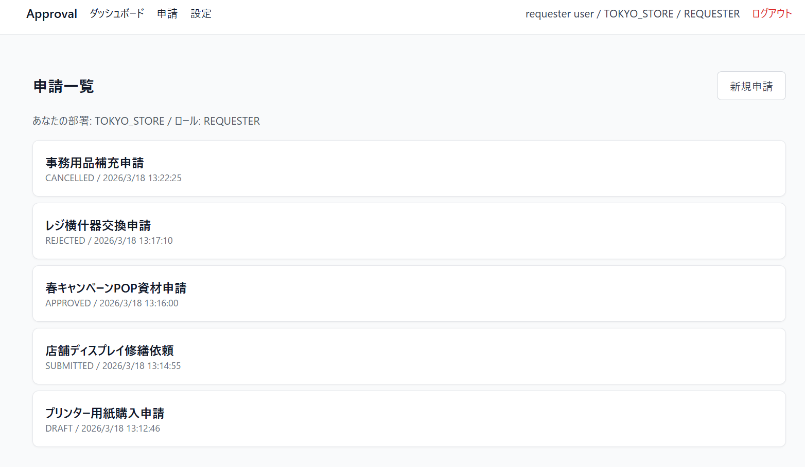
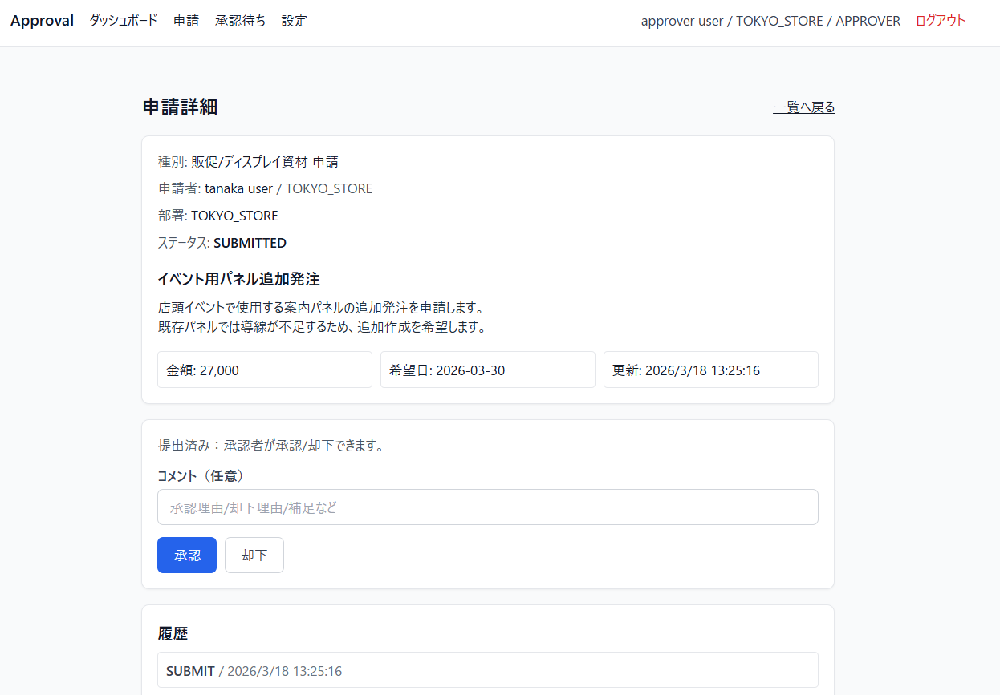
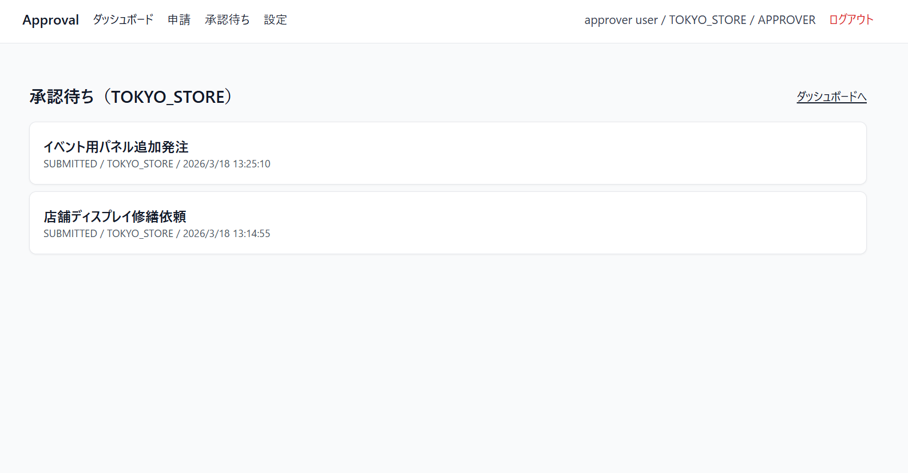
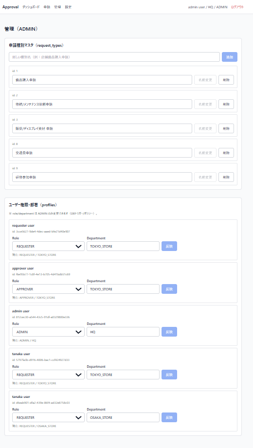
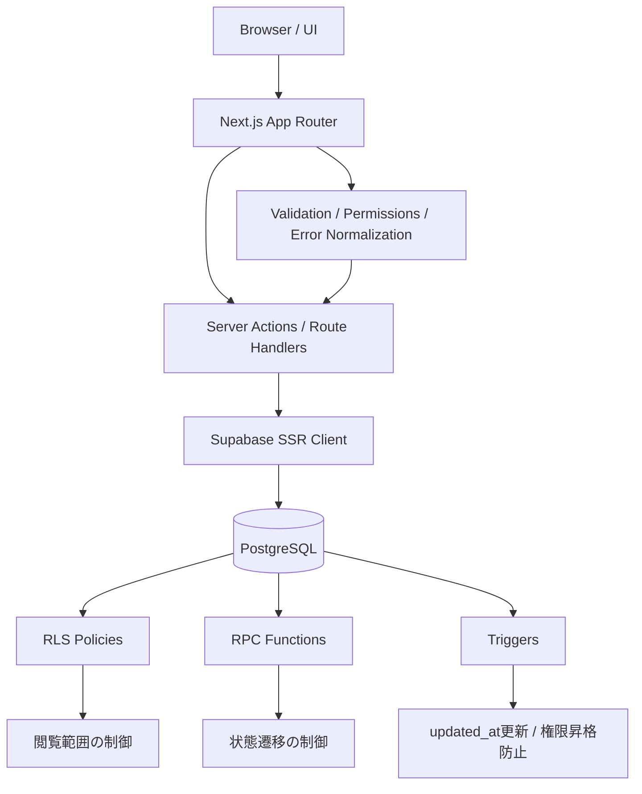
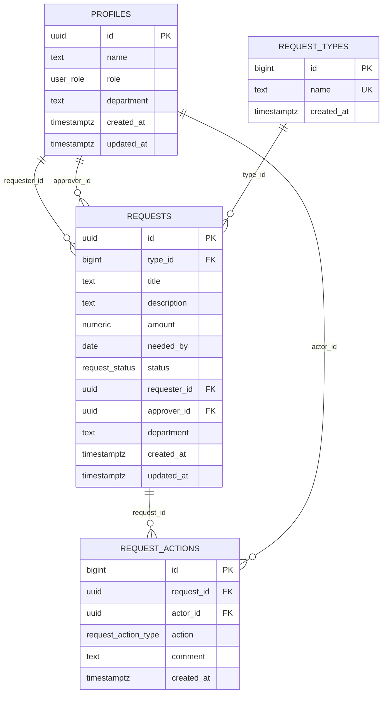

> 企業様へ。
> このリポジトリは継続開発中です。
> 3月応募時点の旧版は以下を参照してください。
> - branch: `submitted/jgc-intern`
> - tag: `portfolio-submitted-jgc-2026-03`

# Approval Workflow App (lvj-approval)

社内申請・承認フローを管理する、ロールベースのワークフロー管理Webアプリです。  
申請者・承認者・管理者ごとに閲覧範囲と操作権限を分け、実務アプリを意識した設計で構築しました。



## Overview

社内業務でよくある以下の申請を想定しています。

- 備品購入申請
- 修繕 / メンテナンス依頼申請
- 販促 / ディスプレイ資材申請

このアプリでは、申請を

**下書き作成 → 提出 → 差し戻し / 承認 / 却下 → 履歴保存**

という流れで扱います。

フロントだけでなく、DBレベルでも権限と状態遷移を制御しており、単なるCRUDではなく「業務ワークフロー」として成立する構成を目指しました。

---

## Screenshots

### 1. ダッシュボード
ログインユーザーのロールと部署、主要導線を確認できるトップ画面です。


### 2. 申請一覧
自分または権限範囲内の申請を一覧で確認できます。



### 3. 申請詳細
申請内容、ステータス、履歴、実行可能なアクションを1画面で確認できます。  
この画面が本アプリの中核です。



### 4. 承認待ち一覧
承認者 / 管理者が提出済み申請を確認する画面です。



### 5. 管理画面
申請種別マスタと、ユーザーのロール / 部署を管理できます。



---

## Features

### 申請機能
- 申請の新規作成（下書き）
- 下書き編集
- 申請提出
- 申請取消
- 申請一覧表示
- 申請履歴表示
- 申請一覧のキーワード検索 / ステータス絞り込み / 種別絞り込み

### 承認機能
- 提出済み申請の承認
- 提出済み申請の却下
- 提出済み申請の差し戻し
- 差し戻し後の再編集・再提出
- 承認コメント / 却下コメント / 差し戻しコメント記録
- 差し戻し / 却下は理由コメント必須化
- 承認一覧のキーワード検索 / ステータス絞り込み

### 管理機能
- 申請種別マスタ管理
- ユーザーのロール変更
- ユーザーの部署変更
- 管理画面でのユーザー検索（name / department / role）
- `request_types` の検索 / 並び替え / 重複防止UI

### 認証・設定機能
- メールアドレス / パスワードによるログイン
- パスワード再発行（メールリンク方式）
- パスワード再発行時のレート制限のエラーハンドリング
- メールアドレス変更
- パスワード変更
- 重要操作に対する再認証フロー（設定画面のパスワード変更）
- 主要画面でのエラー表示統一（toast / inline message）

---

## Tech Stack

### Frontend
- Next.js 15 (App Router)
- React 18
- TypeScript
- Tailwind CSS

### Backend / DB
- Supabase
- PostgreSQL
- Row Level Security (RLS)
- RPC
- Trigger

### Auth
- Supabase Auth
- SSR対応のCookieセッション

### Testing
- Vitest
- Playwright
- GitHub Actions（簡易CI）

---

## Role Design

申請者・承認者・管理者で責務を分け、画面表示だけでなく操作可能範囲も分離しています。

| Role | 権限 |
|---|---|
| REQUESTER | 自分の申請を作成・編集・提出・取消、差し戻し後の再編集・再提出 |
| APPROVER | 同部署の提出済み申請を承認 / 差し戻し / 却下（自分が申請者の案件は不可） |
| ADMIN | 全申請の閲覧、自分の申請作成、自分の DRAFT / RETURNED 申請の編集、提出済み申請の承認 / 差し戻し / 却下、申請種別マスタ管理、既存ユーザーの role / department 管理（自分が申請者の案件は決裁不可） |

---

## Request Status

申請は状態遷移を明確にした上で、以下のステータスで管理しています。

- `DRAFT`
- `SUBMITTED`
- `RETURNED`
- `APPROVED`
- `REJECTED`
- `CANCELLED`

---

## Architecture



---

## ER Diagram

本設計はユーザー、申請種別、申請本体、操作履歴を分離して正規化しています。  
一方で `requests.department` は、申請時点の所属部署を保持し、権限制御と監査性を安定させるために意図的に保持しています。  
また、`profiles.id` は Supabase Auth のユーザーIDと対応しています。



---
## Security Design

このアプリでは、フロント側の表示制御だけでなく、**DBレベルでも権限を担保**しています。

### 1. Row Level Security（RLS）
ユーザーのロールと部署に応じて、参照可能なデータ範囲を制御しています。

- **REQUESTER**: 自分の申請のみ参照可能
- **APPROVER**: 自部署の申請のみ参照可能
- **ADMIN**: 全件参照可能

### 2. Privilege Escalation Prevention
非ADMINユーザーが `role` や `department` を変更できないよう、DBトリガーで制御しています。

### 3. RPCによる状態遷移制御
申請の状態変更は、以下のRPC経由でのみ実行します。

- `submit_request`
- `cancel_request`
- `decide_request`
- `return_request`

これにより、クライアントからの直接更新や不正なステータス変更を防いでいます。  
また、承認・却下・差し戻しについては、申請者本人が自分の申請を決裁できないようDB側で制御しています。
また、下書き編集は申請者本人の DRAFT / RETURNED に限定し、ADMIN であっても他人の未確定申請は編集できないようにしています。

### 4. Auth Operation Hardening
認証系の重要操作では、単にログイン済みセッションに依存せず、追加確認を行う設計にしています。
設定画面のパスワード変更では再認証フローを導入し、ログイン前のパスワード再発行では送信失敗やレート制限時のエラーをUIに反映するようにしています。

---

## Validation / Permission Design

入力値は **Zod** で検証し、表示側の分岐ロジックは `permissions.ts` に集約しています。  
UI側とDB側の両方でルールを持つことで、**使いやすさと安全性を両立**する設計にしています。

---

## Testing

### Unit Test
- バリデーション
- 権限判定ロジック

### E2E Test
- 未ログイン時のガード
- 申請者の下書き作成 / 更新 / 提出
- 承認者の差し戻し
- 差し戻し後の申請者による再編集 / 再提出
- 承認者の承認操作
- 管理者の申請種別追加

テストコードを用意し、主要フローが壊れていないことを確認できるようにしています。

---

## Development Background

個人開発では、最初にReactでToDoアプリを作成しました。  
当初はMVPとして成立していましたが、認証・状態管理・API連携を整理しないまま拡張しようとして、構造全体の管理性が大きく下がりました。

この経験から、以下の重要性を学びました。

- MVP思考
- スコープ管理
- 責務分離
- 拡張前の設計整理

その反省を活かし、このアプリでは最初に役割と状態遷移を整理し、DB設計・権限設計を明確にした上で実装しました。

---

## Current Limitations

このアプリは学習目的のMVPとして開発しています。

### ユーザー登録機能
ユーザーの新規登録UIは実装していません。  
現在は、Supabase Auth / DBへ事前にユーザーを登録する前提です。

### ユーザー追加方法
現時点では、管理者が画面上から新規ユーザーを作成する機能は未実装です。  
そのため、初期ユーザーの追加はDBまたは認証基盤側で行う想定です。

### `request_types` の重複防止
`request_types.name` はDBの `unique` 制約で重複を防止しています。  
加えて、管理画面ではUI側でも同名の申請種別を事前に検出し、追加・変更を抑止するようにしています。

### 動作環境
学習目的のため、本アプリはローカル環境で動作確認しています。
必要に応じて、面接時にローカル環境で動作説明可能です。

### 認証メール送信
Supabase Auth のメール送信を利用しています。
開発環境では組み込み送信のレート制限を考慮し、再送エラー時のハンドリングを実装しています。
今後は独自SMTP導入も改善対象です。

---

## Planned Improvements

### Security / Auth
- `update-email` の Origin / CSRF 対策強化
- 認証メール送信まわりの監査ログ対応
- CSP / Rate Limit / CORS の最終整備
- 認証確認フローにおける hash 依存の見直し

### UX / Workflow
- 承認一覧のさらなるフィルタ強化
- 履歴表示の actor 名表示
- 一覧画面の集計表示
- CSVエクスポート

### Operations
- 管理者によるユーザー招待機能

### Environment
- Docker対応
- デプロイ構成の整備

---

## Setup

### 1. Install

```bash
npm install
```
### 2. Environment Variables

`.env.local` に以下を設定します。

```env
NEXT_PUBLIC_SUPABASE_URL=your_supabase_url
NEXT_PUBLIC_SUPABASE_ANON_KEY=your_supabase_anon_key
SUPABASE_SERVICE_ROLE_KEY=your_service_role_key
```

Playwright E2E を実行する場合は、 `.env.e2e.local` も使用します。
設定例は `.env.example` を参照してください。

### 3. Run

```bash
npm run dev
```

### 4. Test

```bash
npm run test
npm run test:e2e
```

### DB Setup
Supabase SQL Editor もしくは Supabase CLI で、以下の migration を順に適用してください。

- `supabase/migrations/20260325_init.sql`
- `supabase/migrations/20260409_phase2_returned_enum.sql`
- `supabase/migrations/20260409_phase2_returned_workflow.sql`

初期ユーザーの作成は Supabase Auth 側で行い、`profiles` は signup trigger により自動作成されます。

### Demo Users (optional)
ローカルデモ用に Supabase Auth でユーザーを作成した後、`supabase/seed-demo-users.sql` を実行すると、デモ用の role / department をまとめて設定できます。

---

## Why I Built This

単にCRUDを作るだけでなく、
「権限」「状態遷移」「操作履歴」「テスト」まで含めて、
業務アプリとして成立する最小構成を作りたいと考えたためです。

---

## Author

個人開発として、ログアプリと申請・承認管理アプリを制作しています。
新しい技術を学びながら、設計と実装の両方を説明できるエンジニアを目指しています。
